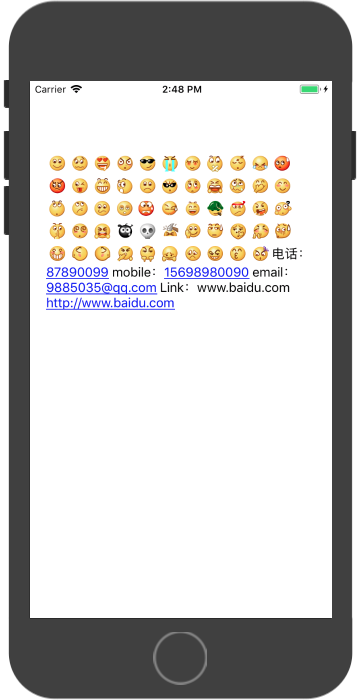

YLEmojiLabel
============

自动识别网址、号码、邮箱和表情的label。
可以自定义自己的表情识别，和对应的表情图像。(默认是识别微信的表情符号)

通过继承YYTextParser实现，使用YYLabel然后设置其textParser即可。
label的特性全都有，使用起来更友好更方便。

## Example

```

    YYLabel * _textView = [YYLabel new];
    _textView.numberOfLines = 0;
    _textView.textAlignment = NSTextAlignmentLeft;
    _textView.preferredMaxLayoutWidth = [UIScreen mainScreen].bounds.size.width-40;
    _textView.font = [UIFont systemFontOfSize:16.0];
    YYTextParserGroup * parserGroup = [YYTextParserGroup textParsesGroupChatWithFont:[UIFont systemFontOfSize:16.0]];
    _textView.textParser = parserGroup;
    [self.view addSubview:_textView];
    _textView.frame = CGRectMake(20, 88, [UIScreen mainScreen].bounds.size.width-40, 500);
    _textView.text = @"/::)/::~/::B/::|/:8-)/::</::$/::X/::Z/::'(/::-|/::@/::P/::D/::O/::(/::+/:--b/::Q/::T/:,@P/:,@-D/::d/:,@o/::g/:|-)/::!/::L/::>/::,@/:,@f/::-S/:?/:,@x/:,@@/::8/:,@!/:!!!/:xx/:bye/:wipe/:dig/:handclap/:&-(/:B-)/:<@/:@>/::-O/:>-|/:P-(/::'|/:X-)/::*/:@x电话：87890099 mobile：15698980090 email：9885035@qq.com Link：www.baidu.com http://www.baidu.com";
    [_textView sizeToFit];

```


## YYTextParserGroup

* 继承于YYTextParser，将多个Parser集成到一起。
* 通过重写 " - (BOOL)parseText: selectedRange: "  遍历 parsers 一一解析子parser实现

```
Example:
    YYTextParserGroup * parserGroup = [YYTextParserGroup new];
    //表情parser
    NSMutableDictionary *mapper = [NSMutableDictionary new];

    YYTextEmoticonParser *emoticonParser = [YYTextEmoticonParser new];
    emoticonParser.emoticonMapper = mapper;
    NSDictionary * emojiDic = [parserGroup emojiDictionary];
    NSMutableDictionary *imageDic = [NSMutableDictionary new];
    for (NSString* emojiKey in emojiDic.allKeys) {
    imageDic[emojiKey] = [parserGroup imageWithName:emojiDic[emojiKey]];
    }
    emoticonParser.emoticonMapper = imageDic;
    //链接电话邮箱parser
    YYTextRichParser *richParser = [YYTextRichParser new];
    richParser.detector = [NSDataDetector dataDetectorWithTypes:NSTextCheckingTypeLink|NSTextCheckingTypePhoneNumber error:nil];
    richParser.font = font;

    parserGroup.parsers = @[richParser,emoticonParser];
```

### YYTextRichParser

通过传入NSTextCheckingType 来检测解析对应类型，并将对应区域添加高亮和点击事件。
 <br\>
已实现类型：<br\>
NSTextCheckingTypeLink :链接网址、邮箱 <br\>
NSTextCheckingTypePhoneNumber:电话


### YYTextEmoticonParser

-   表情解析，通过key-value（表情key-表情图片名）的plist文件，生成正则表达式，然后在检索目标文本，将表情key解析为UIImage图片。
-   如需扩展只需要将对应的plist配置好，并将资源图添加好即可。


